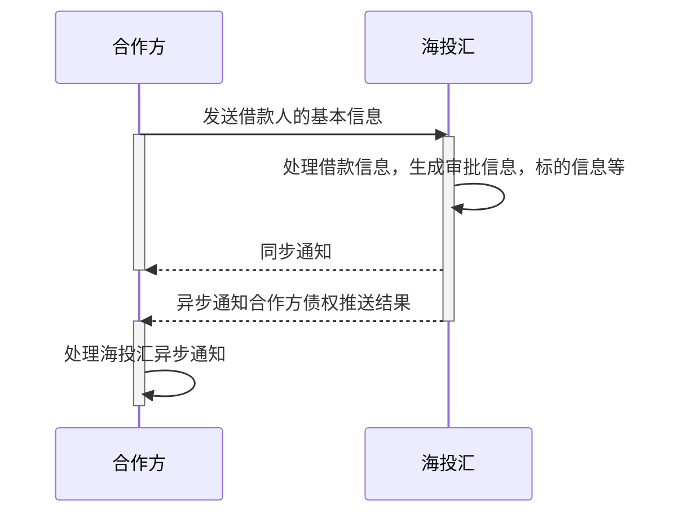

# 债权推送相关接口

## 时序图

### 

## 接收债权信息接口

### 功能说明

当借款用户在第三方完成注册、开户授权等操作，可以通过该接口向海投汇推送债权信息。债权信息需要第三方唯一订单ID来进行唯一区分，推送异步通知时也需要根据该值来进行推送，所以要保证该值唯一。如果合作方同一时间推送了相同的订单ID，那么海投汇视为同一债权信息，直接返回错误信息。

注意：每日运营部门会设置最大接入债权的金额，如果达到最大金额，则不会再接收任何推送的信息，直接在同步信息返回错误状态码，具体见附录。

注意：同步返回错误时不会再发送异步消息通知，同时海投汇也不会保存推送的任何信息，请合作方根据错误信息自行调整再次推送。

### 调用方式

> 接口调用，方式：POST
>

### 调用地址
> /openapi/import-loan
>

### 请求参数

| 字段名              | 字段描述                         | 类型   | 最大长度 | 必填   | 备注                                                         |
| ------------------- | -------------------------------- | ------ | -------- | ------ | ------------------------------------------------------------ |
| 通用字段            |                                  |        |          |        | 参见《通用字段》                                             |
| third_party_user_id | 商户用户id                       | 字符串 | 50       | 必填   | 商户用户id，全局唯一                                         |
| third_order_id      | 合作方唯一订单ID                 | 字符串 | 32       | 必填   | 合作方唯一订单ID                                             |
| amount              | 借款金额                         | 浮点型 | 16       | 必填   | 如：1000.30                                                  |
| period              | 期数                             | 整型   | 10       | 必填   | 代表还款期数，如：分三期归还则传入值3                        |
| loan_purpose        | 借款用途                         | 字符串 | 200      | 必填   | 由合作方提供，中文描述                                       |
| bank_card_type      | 账户类型                         | 字符串 | 4        | 非必填 | 银行卡类型，1:储蓄卡 2:信用卡                                |
| card_number         | 银行账户                         | 字符串 | 32       | 必填   |                                                              |
| bank_code           | 银行编码                         | 字符串 | 20       | 非必填 |                                                              |
| bank_name           | 银行支行名称                     | 字符串 | 200      | 必填   |                                                              |
| bank_area           | 开户行城市                       | 字符串 | 50       | 必填   |                                                              |
| real_name           | 用户姓名                         | 字符串 | 100      | 必填   |                                                              |
| mobile              | 用户电话                         | 字符串 | 20       | 必填   |                                                              |
| birthday            | 用户出生日                       | 字符串 |          | 必填   |                                                              |
| card_type           | 证件类型                         | 字符串 | 4        | 非必填 |                                                              |
| gender              | 性别                             | 字符串 | 4        | 必填   | 1: 男, 2:女                                                  |
| id_card_front       | 身份证正面照片                   | 字符串 | 200      | 必填   | 图片链接地址，该地址由合作方提供                             |
| id_card_back        | 身份证背面照片                   | 字符串 | 200      | 必填   | 图片链接地址，该地址由合作方提供                             |
| id_card_hold        | 身份证手持照片                   | 字符串 | 200      | 必填   | 图片链接地址，该地址由合作方提供                             |
| loan_type           | 项目类型                         | 字符串 | 4        | 非必填 |                                                              |
| guarantee_info      | 担保信息                         | 字符串 | 1000     | 非必填 |                                                              |
| risk_control        | 风控措施                         | 字符串 | 1000     | 非必填 |                                                              |
| id_card_number      | 身份证号                         | 字符串 | 30       | 必填   |                                                              |
| marital_status      | 婚姻状况                         | 字符串 | 4        | 必填   | 婚姻状况 1:未婚,2:已婚,3:离异,4:丧偶,5:再婚,6:复婚           |
| income              | 月均收入                         | 字符串 | 30       | 必填   |                                                              |
| family_income       | 家庭月均收入                     | 字符串 | 30       | 非必填 |                                                              |
| work_type           | 工作性质                         | 字符串 | 4        | 必填   | 1:高级资深人员,2:中级技术人员,3:初级、助理人员,4:见习专员,5:高层管理人员,6:中层管理人员,7:基层管理人员,8:普通员工 |
| industries          | 从事行业                         | 字符串 | 4        | 必填   | 行业 1:金融/银行/保险,2:计算机/互联网/通信/电子,3:贸易/消费/制造,4:医疗/制药,5:广告/媒体,6:房地产/建筑,7:教育/培训/咨询,8:服务业（餐饮、酒店、休闲、美容、体育）等,9:能源/材料,10:政府/NGO,11:其他 |
| address             | 工作所在地                       | 字符串 | 200      | 必填   |                                                              |
| gender              | 性别                             | 字符串 | 4        | 必填   | 1: 男, 2:女                                                  |
| has_child           | 有无子女                         | 字符串 | 1        | 必填   | 0:无,1:有                                                    |
| degree              | 文化程度                         | 字符串 | 4        | 必填   | 学历 1:高中以下,2:高中/中专,3:大专,4:本科,5:研究生           |
| employment_year     | 现单位工作年限                   | 字符串 | 10       | 必填   |                                                              |
| income_desc         | 借款人收入状况                   | 字符串 | 100      | 非必填 |                                                              |
| overdue             | 近6个月借款逾期情况              | 字符串 | 200      | 非必填 |                                                              |
| card_overdue        | 近6个月贷记卡逾期情况            | 字符串 | 200      | 非必填 |                                                              |
| other_loan          | 借款人在其他网络借贷平台借款情况 | 字符串 | 500      | 非必填 |                                                              |
| asset_rate          | 借款人资产负债率                 | 字符串 | 1000     | 必填   |                                                              |
| formal_credit       | 人行征信                         | 字符串 | 200      | 非必填 |                                                              |
| publish_count       | 发布借款次数                     | 字符串 | 10       | 必填   |                                                              |
| success_count       | 成功借款次数                     | 字符串 | 10       | 必填   |                                                              |
| repay_count         | 还清笔数                         | 字符串 | 10       | 必填   |                                                              |
| repay_desc          | 还款来源                         | 字符串 | 10       | 必填   |                                                              |

### 响应参数

| 字段名              | 字段描述     | 类型 | 最大长度 | 备注             |
| ------------------- | ------------ | ---- | -------- | ---------------- |
| 通用字段            |              |      |          | 参见《通用字段》 |
| third_party_user_id | 商户用户id   | 字符串    | 50       | 同请求参数 |
| third_order_id | 合作方唯一订单ID | 字符串 | 32 | 同请求参数 |
| status              | 状态         | 字符串    | 1        | 0:失败；1:成功;  |

##  借款结果消息推送（合作方提供）

###  功能说明
资产接入后，标的各阶段的处理结果消息推送。

注意：由于该推送消息接口会在该标的的生命周期中持续的推送异步通知，所以该地址由双方开发人员协商产生，并配置到海投汇的系统中。

### 调用方式
> 接口调用，方式：POST
>

### 请求地址
> 合作方提供
>

### 请求参数

| **字段名**          | **字段描述**       | **类型** | **最大长度** | **必填** | **备注**                                                     |
| ------------------- | ------------------ | -------- | ------------ | -------- | ------------------------------------------------------------ |
| 通用字段            |                    |          |              |          | 参见《通用字段》                                             |
| third_party_user_id | 商户用户id         | 字符串   | 50           | 必填     |                                                              |
| third_order_id      | 合作方唯一订单ID   | 字符串   | 32           | 必填     | 合作方唯一订单ID                                             |
| htouhui_loan_id     | 放款的海投汇标的id | 字符串   | 32           | 非必填   | 当状态为0、2时，该字段为空，1、3、4、5、6状态有该值信息      |
| loan_money          | 筹款金额           | 字符串   | 16           | 必填     |                                                              |
| status              | 标的状态           | 字符串   | 1            | 必填     | 0：初始化； 1：导入成功； 2：导入失败； 3：筹款中； 4：放款成功； 5：还款成功； 6：流标 |
| lend_pay_money      | 放款金额           | 字符串   | 16           | 非必填   | 如果放款成功则该字段必填                                     |
| lend_order_id       | 放款订单号         | 字符串   | 32           | 非必填   | 如果放款成功则该字段必填                                     |
| repay_money         | 还款金额           | 字符串   | 16           | 非必填   | 还款成功必填                                                 |
| repay_order_id      | 还款订单号         | 字符串   | 32           | 非必填   | 还款成功该字段必填                                           |
| loan_cancel_message | 流标原因描述       | 字符串   | 200          | 非必填   | 如果流标则该字段必填                                         |