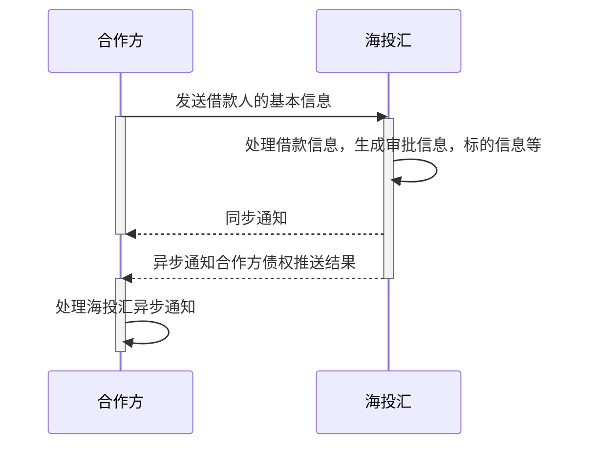

# 时序图

### 

# 接收债权信息接口

## 功能说明

当借款用户在第三方完成注册、开户授权等操作，可以通过该接口向海投汇服务器推送债权信息。

注意：推送的数据如果超出海投汇服务器承受的极限，将会同步返回错误状态码，具体见附录

注意：每日运营部门会设置最大接入债权的金额，如果达到最大金额，则不会再接收任何推送的信息，直接在同步信息返回错误状态码，具体见附录

## 调用方式

> 接口调用，方式：POST
>

## 调用地址
> /openapi/import/loan
>

## 请求参数

### 基础字段

| 字段名              | 字段描述       | 类型   | 最大长度 | 必填             | 备注                             |
| ------------------- | -------------- | ------ | -------- | ---------------- | -------------------------------- |
| 通用字段            |                |        |          | 参见《通用字段》 |                                  |
| third_party_user_id | 商户用户id     | 字符串 | 50       | 必填             | 商户用户id，全局唯一             |
| htouhui_loan_id     | 海投汇标的id   | 字符串 | 32       | 必填             |                                  |
| order_id            | 资方提单号     | 字符串 | 32       | 必填             |                                  |
| lending_time        | 放款时间       | 字符串 |          |                  |                                  |
| loan_purpose        | 借款用途       | 字符串 | 200      | 必填             |                                  |
| bank_card_type      | 账户类型       | 字符串 | 4        | 必填             | 银行卡类型，1:储蓄卡 2:信用卡    |
| card_number         | 银行账户       | 字符串 | 32       | 必填             |                                  |
| bank_code           | 银行编码       | 字符串 | 20       | 必填             |                                  |
| bank_name           | 银行支行名称   | 字符串 | 200      | 必填             |                                  |
| bank_area           | 开户行城市     | 字符串 | 50       | 必填             |                                  |
| real_name           | 用户姓名       | 字符串 | 100      | 必填             |                                  |
| mobile              | 用户电话       | 字符串 | 20       | 必填             |                                  |
| birthday            | 用户出生日     | 字符串 |          | 必填             |                                  |
| card_type           | 证件类型       | 字符串 | 4        | 必填             |                                  |
| id_card_number      | 证件号码       | 字符串 | 32       | 必填             |                                  |
| gender              | 性别           | 字符串 | 4        | 必填             | 1: 男, 2:女                      |
| request_amount      | 申请金额       | 字符串 | 16       | 必填             |                                  |
| amount              | 实际放款金额   | 字符串 | 16       | 必填             |                                  |
| period              | 期数           | 字符串 | 10       | 必填             |                                  |
| id_card_front       | 身份证正面照片 | 字符串 | 200      | 必填             | 图片链接地址，该地址由合作方提供 |
| id_card_back        | 身份证背面照片 | 字符串 | 200      | 必填             | 图片链接地址，该地址由合作方提供 |
| id_card_hold        | 身份证手持照片 | 字符串 | 200      | 必填             | 图片链接地址，该地址由合作方提供 |

### 标的审核字段

| 字段名              | 字段描述               | 类型   | 最大长度 | 必填 | 备注                       |
| ------------------- | ---------------------- | ------ | -------- | ---- | -------------------------- |
| third_party_user_id | 商户用户id             | 字符串 | 50       | 必填    |                            |
| htouhui_loan_id     | 海投汇标的id           | 字符串      | 32       | 必填    |                            |
| user_id             | 借款人用户名           | 字符串      | 32       | 必填    |                            |
| amount              | 借款金额               | 字符串      | 16       |      |                            |
| interest            | 借款利息(%)            | 字符串      | 16       | 必填    |                            |
| deadline            | 借款期限               | 字符串      | 10       | 必填    |                            |
| real_loan_user      | 实际借款人姓名         | 字符串      | 100      | 必填    |                            |
| guarantee_type      | 担保方式               | 字符串      | 50       | 必填    |                            |
| partner             | 合作机构               | 字符串      | 100      | 必填    |                            |
| agency_fee          | 中介费                 | 字符串      | 16       | 必填    |                            |
| caution_money       | 保证金(%)              | 字符串      | 16       | 必填    |                            |
| fee_rate            | 手续费利率(%)          | 字符串      | 16       | 必填    |                            |
| fee_pay_type        | 手续费收取方式         | 字符串      | 4        | 必填    | 1:先行收取，2:随还款时收取 |
| loan_type           | 项目类型               | 字符串      | 4        | 必填    |                            |
| loan_interest       | 标的利率(%)借款利息(%) | 字符串      | 16       | 必填    |                            |
| subject_interest    | 标的类型借款利息(%)    | 字符串      | 16       | 必填    |                            |
| guarantee_info      | 担保信息               | 字符串      | 1000     | 必填    |                            |
| loan_introduction   | 项目简介               | 字符串      | 1000     | 必填    |                            |
| risk_control        | 风控措施               | 字符串      | 1000     | 必填    |                            |
| loan_purpose        | 借款用途               | 字符串      | 200      | 必填    |                            |
| guaranty_desc       | 抵押物信息             | 字符串      | 500      | 必填    |                            |
| loan_attachment     | 项目资料               | 字符串      | 200      | 必填    |                            |
| loaner_attachment   | 借款人信息附件         | 字符串      | 200      | 必填    |                            |

### 借款人信息披露字段

| 字段名          | 字段描述                         | 类型 | 最大长度 | 必填 | 备注                                                         |
| --------------- | -------------------------------- | ---- | -------- | ---- | ------------------------------------------------------------ |
| htouhui_loan_id | 放款的海投汇标的id               | 字符串    | 32       | 必填    |                                                              |
| name            | 姓名                             | 字符串    | 100      | 必填    |                                                              |
| birthday        | 用户出生日                       | 字符串    |          |      |                                                              |
| id_card_number  | 身份证号                         | 字符串    | 30       | 必填    |                                                              |
| marital_status  | 婚姻状况                         | 字符串    | 4        | 必填    | 婚姻状况 1:未婚,2:已婚,3:离异,4:丧偶,5:再婚,6:复婚           |
| income          | 月均收入                         | 字符串    | 30       | 必填    |                                                              |
| family_income   | 家庭月均收入                     | 字符串    | 30       | 必填    |                                                              |
| work_type       | 工作性质                         | 字符串    | 4        | 必填    | 1:高级资深人员,2:中级技术人员,3:初级、助理人员,4:见习专员,5:高层管理人员,6:中层管理人员,7:基层管理人员,8:普通员工 |
| industries      | 从事行业                         | 字符串    | 4        | 必填    | 行业 1:金融/银行/保险,2:计算机/互联网/通信/电子,3:贸易/消费/制造,4:医疗/制药,5:广告/媒体,6:房地产/建筑,7:教育/培训/咨询,8:服务业（餐饮、酒店、休闲、美容、体育）等,9:能源/材料,10:政府/NGO,11:其他 |
| address         | 工作所在地                       | 字符串    | 200      | 必填    |                                                              |
| gender          | 性别                             | 字符串    | 4        | 必填    | 1: 男, 2:女                                                  |
| has_child       | 有无子女                         | 字符串    | 1        | 必填    | 0:无,1:有                                                    |
| degree          | 文化程度                         | 字符串    | 4        | 必填    | 学历 1:高中以下,2:高中/中专,3:大专,4:本科,5:研究生           |
| employment_year | 现单位工作年限                   | 字符串    | 10       | 必填    |                                                              |
| income_desc     | 借款人收入状况                   | 字符串    | 100      | 必填    |                                                              |
| loan_purpose    | 借款用途                         | 字符串    | 200      | 必填    |                                                              |
| overdue         | 近6个月借款逾期情况              | 字符串    | 200      | 非必填    |                                                              |
| card_overdue    | 近6个月贷记卡逾期情况            | 字符串    | 200      | 非必填    |                                                              |
| other_loan      | 借款人在其他网络借贷平台借款情况 | 字符串    | 500      | 非必填    |                                                              |
| asset_rate      | 借款人资产负债率                 | 字符串    | 1000     | 必填    |                                                              |
| formal_credit   | 人行征信                         | 字符串    | 200      | 必填    |                                                              |
| id_card_number  | 身份证                           | 字符串    | 32       | 必填    |                                                              |
| publish_count   | 发布借款次数                     | 字符串    | 10       | 必填    |                                                              |
| success_count   | 成功借款次数                     | 字符串    | 10       | 必填    |                                                              |
| repay_count     | 还清笔数                         | 字符串    | 10       | 必填    |                                                              |
| repay_desc      | 还款来源                         | 字符串    | 10       | 必填    |                                                              |

## 响应参数

| 字段名              | 字段描述     | 类型 | 最大长度 | 必填 | 备注             |
| ------------------- | ------------ | ---- | -------- | ---- | ---------------- |
| 通用字段            |              |      |          |      | 参见《通用字段》 |
| third_party_user_id | 商户用户id   | 字符串    | 50       | 必填    |                  |
| htouhui_loan_id     | 海投汇标的id | 字符串    | 32       | 必填    |                  |
| status              | 状态         | 字符串    | 1        | 必填    | 0:失败；1:成功;  |

# 导入债权结果消息推送（合作方提供）

## 功能说明

当合作方推送债权信息到海投汇后，由于债权需要的信息数量比较大，所以海投汇会在后台持续处理数据，时间为几秒到几分钟不等。

## 调用方式

> 接口调用，方式：POST
>

## 调用地址

> 由合作方提供
>

### 请求参数

| 字段名              | 字段描述     | 类型 | 最大长度 | 必填             | 备注                        |
| ------------------- | ------------ | ---- | -------- | ---------------- | --------------------------- |
| 通用字段            |              |      |          | 参见《通用字段》 |                             |
| third_party_user_id | 商户用户id   | 字符串    | 50       | 必填                | 商户用户id，全局唯一        |
| htouhui_loan_id     | 海投汇标的id | 字符串    | 32       | 必填                |                             |
| order_id            | 资方提单号   | 字符串    | 32       | 必填                |                             |
| status              | 状态         | 整型 | 1        | 必传             | 0：处理中，1：成功，2：失败 |