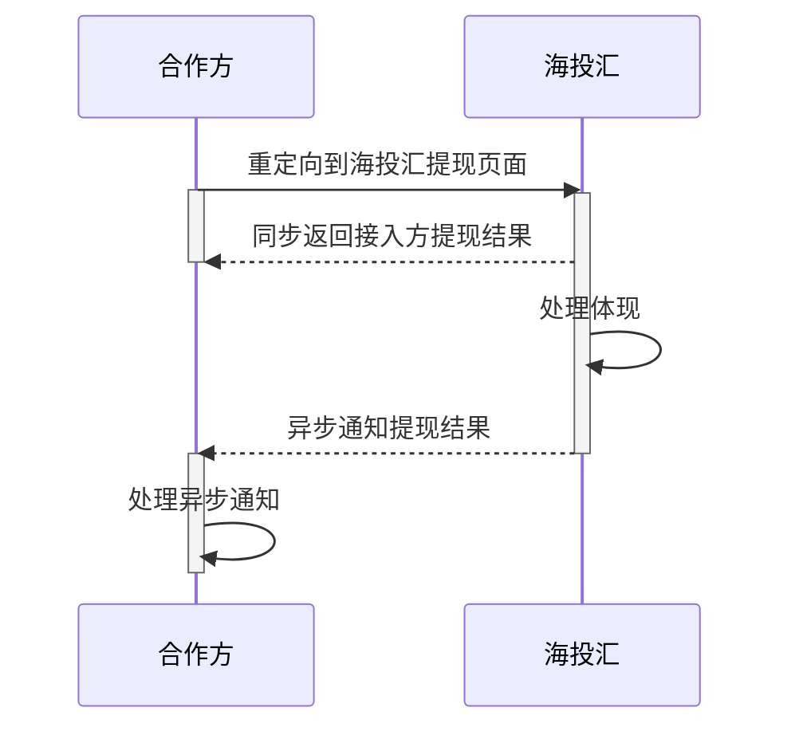

# 时序图

# 提现接口

## 功能说明

确认放款成功后，可根据此接口进行提现操作，提现结果异步通知。

## 调用方式

> 页面调用，方式：POST
>

## 请求地址

> 待定
>

## 请求参数

| **字段名**          | **字段描述**         | **类型** | **最大长度** | **必填** | **备注**                                |
| ------------------- | -------------------- | -------- | ------------ | -------- | --------------------------------------- |
| 通用字段            |                      |          |              |          | 参见《通用字段》                        |
| third_party_user_id | 商户用户id           | A        | 50           | M        | 商户用户id，全局唯一                    |
| htouhui_user_id     | 海投汇用户id         | A        | 11           | M        | 结果通知会post到此url                   |
| money               | 提现金额             | A        | 16           | M        |                                         |
| return_url          | 返回页面链接         | A        | 256          | M        | Get方式跳转                             |
| notify_url          | 后台通知链接         | A        | 200          | M        | 结果通知会post到此url                   |
| from_url            | 商户用户操作提现页面 | A        | 256          | M        | 用户提现操作重置交易密码后返回的页面url |

### 响应参数

| **字段名**          | **字段描述** | **类型** | **最大长度** | **必填** | **备注**         |
| ------------------- | ------------ | -------- | ------------ | -------- | ---------------- |
| 通用字段            |              |          |              |          | 参见《通用字段》 |
| htouhui_user_id     | 海投汇用户id | A        | 11           | M        |                  |
| third_party_user_id | 商户用户id   | A        | 50           | M        |                  |
| money               | 提现金额     | A        | 16           | M        |                  |
| order_id            | 交易订单号   | A        | 32           | M        |                  |

 

# 接收提现状态接口（合作方提供）

## 功能说明

提现之后，发送异步通知提现结果给合作方，合作方根据自己的业务进行处理。

## 调用方式

> 接口调用，方式：POST
>

## 请求地址

> 待定
>

## 请求参数

| **字段名**          | **字段描述** | **类型** | **最大长度** | **必填** | **备注**              |
| ------------------- | ------------ | -------- | ------------ | -------- | --------------------- |
| 通用字段            |              |          |              |          | 参见《通用字段》      |
| third_party_user_id | 商户用户id   | A        | 50           | M        | 商户用户id，全局唯一  |
| htouhui_user_id     | 海投汇用户id | A        | 11           | M        | 结果通知会post到此url |
| money               | 提现金额     | A        | 16           | M        |                       |
| status              | 扣款状态     | A        | 256          | M        | 0：失败，1：成功      |